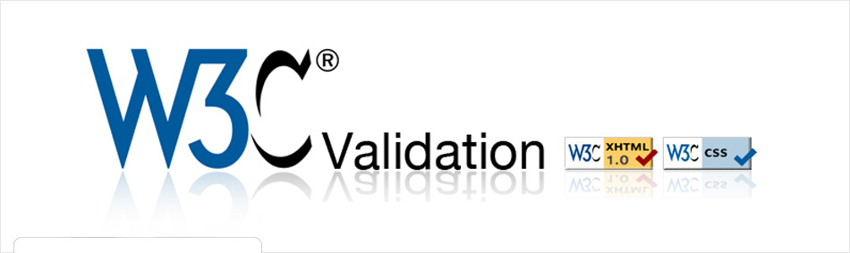

# 揭开CSS的面纱

如果您对前端方面有所关注，那么对CSS一定不会陌生，你也肯定听说过一些CSS的新特性。在使用CSS新特性之前，你应该对这个新一代样式表语言的来龙去脉有个基本了解。

在本章节中，你将知道目前的CSS和以前的CSS（比如以前有的版本CSS2.1）的区别，以及当前市面上主流浏览器、移动端浏览器对CSS新特性的一个支持情况。对于那些尚不完全支持CSS新特性，将会为大家引入一个渐进增强的概念，用一些CSS的老方法来模拟CSS新特性的实现方法。当然不是所有新特性都有渐进增强或者降级处理的方案，在实际使用的过程中，应该根据自己的实际情况做出适合的选择。

## Web标准

从维基百科中，我们可以得知。Web标准又被称为网页标准，一般是指有关于万维网各个方面的定义和说明的正式标准以及技术规范。近年来，这个术语也时常和一套建立网站的标准化的最佳实践方法、网页设计的原理、以及上述方法的衍生物连续在一起。

Web标准不是一种单一的标准规范，而是由一些规范共同组成的标准集合，是由W3C和其它的标准化组织共同制定，用来创建和解释基于Web的内容。这些规范是专门为了那些在网上发布的可向后兼容的文档所设计，使其能够被大多数人所访问。

这些标准和规范往往彼此相依，其中一部分甚至延伸到互联网，而不仅限于万维网，并直接或间接的影响到网站以及Web服务的发展和管理。同时也考量到网页或网站的协同工作能力、无障碍性、易用性。

网页主要由三部分组成：结构（Structure）、表现（Presentation）和行为（Behavior）。如果有网站或网页宣称遵循网页标准，通常表示他们的网页符合HTML（或HTML5，或XHTML）、CSS和JavaScript等标准。对应的标准也分三方面：结构化标准语言主要包括XHTML和XML，表现标准语言主要包括CSS，行为标准主要包括对象模型（如W3C DOM）、ECMAScript等。而我们要讲的CSS就是Web标准中的表现标准语言。

CSS是Cascading Style Sheets层叠样式表的缩写。W3C创建CSS标准的目的是以CSS取代HTML表格布局、帧和其他表现的语言。

### 标准的制定过程

W3C并不直接产生标准。W3C以工作组的方式，把某项技术的相关各方聚集在一起，最终由他们来产生标准。当然，W3C并不只是一个观察者，他设定了整个平台的规则，也会监督整个进程。但这些技术规范，基本上并不是由W3C工作组的工作人员编写完成的。而我们所说的CSS规范通常是由W3C工作组中的CSS工作组的成员来编写。其人员组成主要由来自W3C会员公司的成员（比如浏览器厂商、主流网站、研究机构和常规技术公司等）、特邀专家（被邀请参与标准制定的Web开发者）和W3C工作人员三个部分组成。

很多Web开发者普遍认为W3C手握标准，主宰Web的生杀大权，而浏览器厂端们则不敢不遵从。事实上并非如此，哪些东西该进入Web标准，浏览器厂商比W3C有更多的发言权，因为浏览器实不实现制定下来的标准，还是有他们说了算。

另外很多Web开发者普遍都会认为，Web标准与自己无关，自己也无法参与。事实上制定Web标准并不是闭门造车。CSS工作组一直坚持透明原则，它内部所有的交流都是公开的，并邀请公众来关注和参与讨论：

- 绝大多数的讨论都发生在工作组的邮件列表中：www-style（[http://lists.w3.org/Archives/Public/www-style](http:// lists.w3.org/Archives/Public/www-style)）。这个邮件列表是公开布档的，欢迎任何人的参与
- 每周都会召开一次电话会议，时长一小时。该会议并不向非工作组成员开放，但会议会被记录在W3C的IRC服务器（[http://irc. w3.org/](http://irc. w3.org/)）上的#css频道。这些会议也会整理出来发布到邮件列表中
- 还有每个季度会有一次面对面会议，也会记录下来。在获得工作组主席的许可之后，这类会议也通常会对观察员开放（就是旁听）

所有这些都是W3C进程的一部分，任何决定都是通过这样的方式来产生的。此外，那些真正负责把这些决定写成规范的人员叫作规范编辑。规范编辑可能是W3C的工作人员、浏览器开发者、相关专业的特邀专家，也可能是会员公司的职员，他们全职从事此项工作，为了共同利益去推进标准。

CSS的每项规范大致都会经历下面这几个过程：

- **编辑草案(ED)**：这是一项规范的初始阶段，可能非常粗糙。对这个阶段没有什么要求，也不保证它会被工作组批准。但它也是各个修订版本的必经阶段，每次变更都是先从一个 ED 中产 生的，然后才会发布出来。
- **首个公开工作草案(FPWD)**：一项规范的首个公开发布版本，它应该准备就绪，以接受工作组的公开反馈。
- **工作草案(WD)**：在第一个 WD 之后，还会有更多的 WD 出来。 这些 WD 会吸收来自工作组和更广阔的社区的反馈，一版接着一版小幅改进。浏览器的早期实现通常是从这个阶段开始的，厂商基本不太可能对更早阶段的草案提供实验性的支持。
- **候选推荐规范(CR)**：这可以认为是一个相对稳定的版本。此时比较适合实现和测试。一项规范只有具备一套完整的测试套件和两个独立的实现之后，才有可能继续推进到下一阶段。
- **提名推荐规范(PR)**：这是 W3C 会员公司对这项规范表达反对意见的最后机会。实际上他们很少在这个阶段提出异议，因此每个 PR 推进到下一阶段(也是最后一个阶段)只是时间问题。
- **正式推荐规范(REC)**：一项 W3C 技术规范的最终阶段。

### 采用Web标准的好处

对于Web页面或者Web应用程序，采用Web标准是有一定的好处。首行对于访问者：

- 文件下载与页面显示速度更快。 
- 内容能被更多的用户所访问（包括失明、视弱、色盲等残障人士）。 
- 内容能被更广泛的设备所访问（包括屏幕阅读机、手持设备、搜索机器人、打印机、电冰箱等等）。 
- 用户能够通过样式选择定制自己的表现界面。 
- 所有页面都能提供适于打印的版本。

对于网站所有者： 

- 更少的代码和组件，容易维护。 
- 带宽要求降低（代码更简洁），成本降低。
- 更容易被搜寻引擎搜索到。 
- 改版方便，不需要变动页面内容。 
- 提供打印版本而不需要复制内容。 
- 提高网站易用性。在美国，有严格的法律条款（Section 508）来约束政府网站必须达到一定的易用性，其他国家也有类似的要求。

早期的Web的开发者对于自己开发的Web页面，都会通过W3C验证服务来验证自己开发的项目。比如HTML的验证（[http://validator.w3.org/](http://validator.w3.org/)）和CSS的验证（[http://jigsaw.w3.org/css-validator/](http://jigsaw.w3.org/css-validator/)），以在页脚附上下图（图1-1）引以为荣，从而向用户展示自己的Web网页是结得住考验的。

*图1-1：HTML和CSS验证标记*

## CSS版本之争

要了解CSS版本之间的故事，就得对CSS的起源有所了解。

CSS开始发展于1994年。最初的CSS提案计划于1994年11月在芝加哥举行的Web会议上提出。而实际上CSS的第一个版本，也就是CSS 1 的规范是1996年由 Håkon Wium Lie 和 Bert Bos发表。CSS1的规范非常的短，而且比较简单。它的内容少到用一个HTML页面就足以呈现，即使用A4的纸打印出来也只需要68页。

1997年2月，CSS成立W3C旗下自己的工作小组，新的工作小组去解决CSS1中没有解决的问题。工作小组有Chris Lilley领导，他是来自曼彻斯特大学的爱尔兰人。CSS2在1998年5月成为推荐标准，它的定义更加严格，囊括了更多的功能。

在 CSS 2 之后，CSS 工作组意识到这门语言已经变得非常庞大，再也无 法把它塞进单个规范中了。这样不仅阅读和编辑极其困难，而且限制了 CSS 本身的快速发展。别忘了，**一项规范如果要推进到最终阶段，其中的每项特 性都必须具备两个独立的实现和全面的测试**。为了促进CSS能得到更好的发展以规范推进速度。所以W3C组织决定将CSS以不同的功能模块细分出去，而且每个功能模块都可以独立更新版本。这其中，那些延续 CSS 2.1 已有特性的模块 会升级到 3 这个版本号。比如以下模块:
„
- CSS 语法([http://w3.org/TR/css-syntax-3](http://w3.org/TR/css-syntax-3))
- CSS 层叠与继承([http://w3.org/TR/css-cascade-3](http://w3.org/TR/css-cascade-3))„
- CSS 颜色([http://w3.org/TR/css3-color](http://w3.org/TR/css3-color))
- CSS 选择器([http://w3.org/TR/selectors](http://w3.org/TR/selectors))„
- CSS 背景与边框([http://w3.org/TR/css3-background](http://w3.org/TR/css3-background)) „ 
- CSS 值与单位([http://w3.org/TR/css-values-3](http://w3.org/TR/css-values-3))„
- CSS 文本排版([http://w3.org/TR/css-text-3](http://w3.org/TR/css-text-3))„
- CSS 文本装饰效果([http://w3.org/TR/css-text-decor-3](http://w3.org/TR/css-text-decor-3))
- CSS 字体(h[ttp://w3.org/TR/css3-fonts](ttp://w3.org/TR/css3-fonts))
- CSS 基本 UI 特性([http://w3.org/TR/css3-ui](http://w3.org/TR/css3-ui))

此外，如果某个模块是前所未有的新概念，那它的版本号将从 1 开始。 比如下面这些:

- CSS 变形([http://w3.org/TR/css-transforms-1](http://w3.org/TR/css-transforms-1))„
- 图像混合效果([http://w3.org/TR/compositing-1](http://w3.org/TR/compositing-1)) „ 
- 滤镜效果([http://w3.org/TR/filter-effects-1](http://w3.org/TR/filter-effects-1))„
- CSS 遮罩([http://w3.org/TR/css-masking-1](http://w3.org/TR/css-masking-1))„
- CSS 伸缩盒布局([http://w3.org/TR/css-flexbox-1](http://w3.org/TR/css-flexbox-1)) „ 
- CSS 网格布局([http://w3.org/TR/css-grid-1](http://w3.org/TR/css-grid-1))

> **提醒作者：上面list需要去验证，更新，并且提供CSS所有功能模块的清单列表**

广大开发者习惯性的延续了CSS 2.1之样的称呼，所以大家喜欢把CSS的新特性称之为CSS3，甚至称之为CSS4（比如最新版本的选择器，很多地方就称为CSS4选择器）。尽管CSS3这个词非常流行，但实际上并没有在任何规范中定义过CSS3。事实上，绝大多数编辑在提到这个词时，指的是一个非正式的集合，它包括CSS规范第三版（Level 3）再加上一些版本号还是Level 1的新规范，比如，CSS网格布局。尽管在哪些规范应该归入 CSS3 的问题上，编辑们达成了一定的共识，但我们也不得不面对现实:

> 由于CSS 的各个模块在近些年里以不同的速度在推进，我们已经越来越难以把这些规范以CSS3、CSS4这样的方式来划分了，而且这样也难以被大众理解和接受。

**所以，大家以后不要再把CSS按CSS3或者CSS4来称谓了，我们应该改变以前的习惯，按功能模块发布的版本号来称呼他们。这样才不会给别人造成误解或困惑！**

